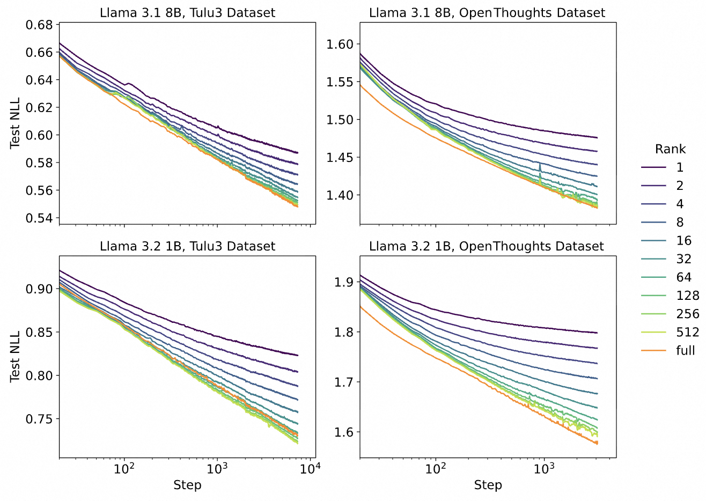
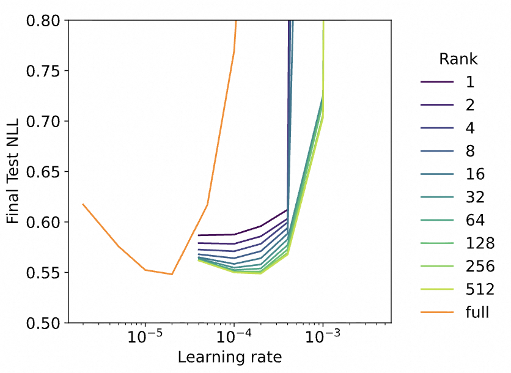
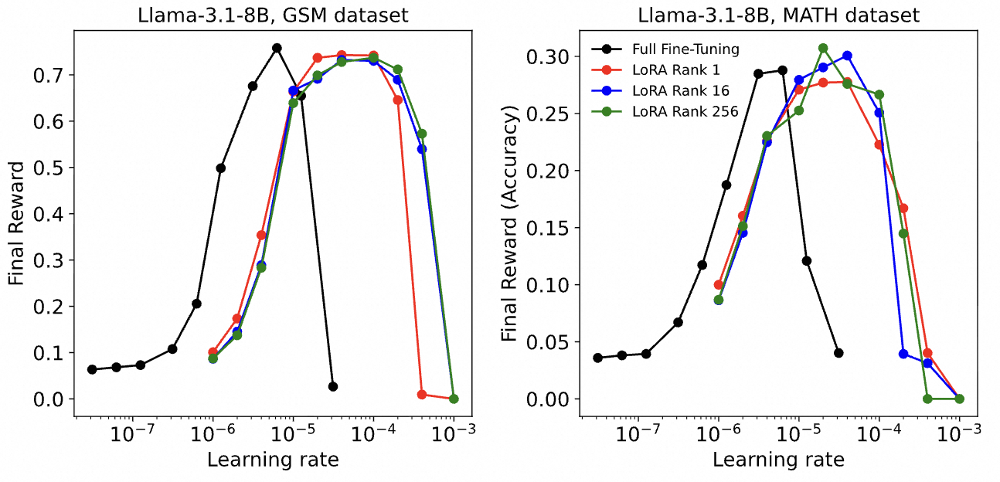

Original link: https://thinkingmachines.ai/blog/lora/

## Why does It Matter?
During SFT and RL, compared with full fine-tuning, when does LoRA perform well, when does it match performance, and when does it fall short?  

## When can LoRA match full fine-tuning performance?

  
Different colored lines represent different ranks. The horizontal axis shows training steps (log scale), and the vertical axis shows the NLL Loss on the test set. Each point on the curve represents `rank = r`, with the minimum loss achieved at `training step = n` for various learning rates.


During SFT, high-rank LoRA and full fine-tuning exhibit similarly linear loss curves, with a high degree of overlap.



From the graph, rank = 64 is already very close to full fine-tuning. This is a good reference for practical post-training applications.
Note: [llama factory](https://github.com/hiyouga/LLaMA-Factory/blob/main/examples/train_lora/llama3_lora_sft.yaml) uses a default rank = 8, and [peft](https://github.com/huggingface/peft) uses rank = 16, both lower than this recommendation. Consider increasing it in practice.



With very small ranks, the rate at which loss decreases slows down during training.  
This can be understood as: if the adapter's capacity is smaller than the complexity of the training data, learning progresses more slowly.


## What is LoRA's optimal learning rate?


LoRA’s optimal learning rate is about 10× that of full fine-tuning.



For larger ranks (> 32), there tends to be a single optimal learning rate (lowest loss).  
For smaller ranks (< 32), a slightly lower learning rate works better.  
In practice, LoRA’s learning rate should generally not exceed 10× the full fine-tuning rate.


## Optimal rank for RL + LoRA


For RL, rank = 1 can achieve the same performance as full fine-tuning (with a learning rate 10× larger).


**Details**: The RL algorithm details here are unclear — whether it’s on-policy or not — but it likely is on-policy, since Thinking Machines tends to focus on on-policy methods.  

## Why does rank=1 work for RL?
With SFT, rank = 1 performs far worse than full fine-tuning. Why can RL match it? The blog’s explanation is that RL data carries less information than SFT data:  
  - In SFT, a response of length `n` contains `O(n)` units of information, since each token has a ground truth target.  
  - In RL, one data sample carries only 1 unit of information — the answer is simply correct or incorrect.  
  - While this may not be mathematically rigorous, the blog argues that even rank = 1 LoRA has more parameters than the calculated information content for RL, so it has enough capacity to learn the required skill.

## How does LoRA’s effective learning rate change with training?
LoRA contains two matrices: `A` (randomly initialized) and `B` (initialized to all zeros).  
Early in training, changes in `A` barely affect the overall `ΔW = A × B`, meaning the *effective* learning rate is low. Later, as `B` values grow, the effective learning rate of `A` increases.  
Therefore:  
- With fewer training samples, it’s better to choose a larger learning rate.  
- With more training samples, the learning rate can be reduced.  

Empirical results:  
- For small datasets, LoRA’s optimal learning rate is ~15× that of full fine-tuning.  
- For large datasets, it’s ~10×.
