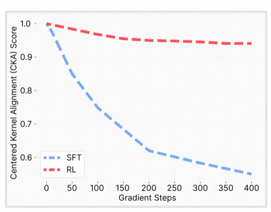

## Basics
**Institution:** MIT  
**Paper Link:** [https://arxiv.org/pdf/2509.04259](https://arxiv.org/pdf/2509.04259)  
**Conference:** Submitted to ICLR 2026

## Why Does It Matter?
This paper provides solid evidence that RL forgets less than SFT. The reason is on-policy training. On-policy training has an implicit low KL constraint. This makes the KL divergence between pre-RL and post-RL model distributions smaller.

## How Does It Work?

### 1. Why Does New Data Adaptation Matter?
The authors first explain why studying the problem of new data adaptation is important: self-evolution. This aligns with the proposal made by Alibaba Cloud CEO Wu Yongming at the [Apsara Conference](http://www.news.cn/tech/20250924/c0c0f36318774c84afa44e06b2868639/c.html).

> Despite their remarkable capabilities, today's models are largely static once deployed: they excel at tasks learned during pre-training or post-training, but are not designed to self-improve and continually acquire new capabilities. We imagine a future where deployed models are long-lived agents assisting humans in the long-term and continuously adapting to new needs. As such, models must improve and adapt to new data, environments, and objectives.

### 2. Frame the Research Question in the Introduction
The paper uses a standalone paragraph in the introduction to pose the question: What is the reason why RL forgets less than SFT? This is worth learning in paper writing—posing a question first can make the entire paper more focused on the key problem to be solved.

> This striking empirical gap raises the question: what underlying mechanism allows RL to improve on new tasks, but unlike SFT, minimally impacts the model's prior knowledge?

### 3. Why Study the Mechanism Rather Than Just Solutions?
There is another discussion about why it is necessary to study this even when many methods already address the forgetting problem. This line of thinking and expression is equally suitable for interpretability research.

> Previous approaches to catastrophic forgetting targeted specific factors such as constraining weight updates (Kirkpatrick et al., 2017; Aljundi et al., 2018; Zenke et al., 2017), preserving learned features (Rannen et al., 2017; Hou et al., 2019), or regularizing shift in output distribution (Li & Hoiem, 2017; Stiennon et al., 2020). While these methods can reduce forgetting, they focus on its effects rather than its underlying cause. Consequently, it remains unclear what truly governs forgetting or why different training algorithms behave so differently.

### 4. Chain of Three Takeaways
The titles of the main sections of the paper are: "Reinforcement Learning Forgets Less than SFT," "Smaller KL divergences lead to less forgetting," and "On-policy methods lead to smaller KL divergence." Each section presents a key takeaway message, with logical connections between them framing a chain of reasoning—this is a very standard, classic, and highly effective writing style. Additionally, each section concludes with a standalone takeaway card that re-emphasizes the chapter's conclusion. The three takeaways are listed below; understanding these three points essentially captures the paper's core conclusions.

* **Takeaway 1:** RL is able to learn new tasks while incurring minimal forgetting, whereas SFT reaches similar new-task performance only by sacrificing prior knowledge.

* **Takeaway 2:** Catastrophic forgetting in both SFT and RL is predicted by the KL divergence between the fine-tuned and base models on the new task.

* **Takeaway 3:** On-policy training explains why RL maintains smaller KL divergence than SFT. Sampling from the model's own distribution keeps it close to the base model, while SFT pushes it toward arbitrary external distributions.

### 5. Why Is KL Divergence the Best Metric for Forgetting?
The paper validates that KL divergence is the best metric for measuring the degree of model forgetting. Note that the KL divergence calculation here is performed on new tasks/new data, measuring the distribution between the base model and the model after SFT/RL training. The larger the KL divergence between these two distributions, the greater the distributional difference between the fine-tuned model and the base model on the new task, and this difference has a strong correlation with forgetting caused by training (R² fit coefficient of 0.96).


A more intuitive instantiation would be to calculate the distributional difference between the base model and the fine-tuned model on the original data. The paper's explanation for this is that the original data used for base model training is unclear downstream, making it difficult to conduct experiments on the foundational data. On th other hand, the paper designed a controlled setting, ParityMNIST to perform systematic ablations. Unfortunately, the ablation of distribution measurement is not included in the paper.


### 6. Special Design: Parity MNIST
Parity MNIST is defined as follows: input an MNIST image and output the parity of the number in the image. For example, if the input is an image with the digit 0, then outputs of 0/2/4/6/8 are all considered correct predictions. A 3-layer MLP is trained on ParityMNIST and FashionMNIST, then SFT and RL are performed on another subset of ParityMNIST.

### 7. Special Design: Oracle SFT
To verify that KL can indeed be used to measure the degree of forgetting, an ideal experiment was designed: for each sample in the training set, select the label with the smallest KL distance while ensuring the model predicts correctly. The model trained via SFT on a training set constructed this way indeed forgets less.


In the LLM's SFT scenario, when a query has multiple correct candidate responses, calculate the average KL distance of the base model on each token of each response, and select the response with the smallest KL as the final response used for SFT—would this strategy leads to less forgetting in SFT?


Note that KL and perplexity (PPL) are not mathematically equivalent here. PPL only considers the probability of the ground truth token ID, whereas KL considers the probability distribution across the entire vocabulary space.


### 8. Why Does On-Policy Training Lead to Smaller KL Divergence?
Compared to SFT, RL has two different characteristics: one is negative samples, and the other is on-policy training. SFT only has positive samples, and the responses in the data are pre-annotated and independent of the base model. In contrast, RL training samples a problem multiple times, i.e., rollout, including both positive and negative samples, and each step's sampling is performed on the latest version of the model after gradient updates—the responses are all the model's own answers. A 2×2 ablation experiment was conducted, ultimately verifying that the key point is on-policy training. The paper explains this as follows:

> At each step, the policy samples outputs it already finds likely, then re-weights those samples according to reward, shifting probability mass toward higher-reward outcomes while suppressing lower-reward ones.

Each response in RL is the model's own answer. The probability of the corrent answer may be large or small, but it is at least within the range of what the model might answer. What RL does is reranking—moving correct answers with "relatively lower" probabilities forward and moving incorrect answers with "relatively higher" probabilities backward.


This "ranking" itself reflects the differences and connections between RLHF and RLVR. Although both involve ranking, RLHF cares about the human preference—whether A is better than B is determined by human annotation. In contrast, RLVR cares about correctness—whether A is better than B is determined by the answer.


Strictly speaking, SFT is also performing ranking because the probability of output tokens is normalized across the vocabulary space. Increasing the probability of the ground truth token-id also decreases the probability of the other token-ids. However, the difference between SFT and RL is that RL performs "one-above-another" ranking—it only needs one token-id to rank higher than another. SFT, on the other hand, performs "one-above-all" ranking—it requires one token-id to rank higher than all other tokens. Although the training objectives may be mathematically equivalent, from an optimization perspective, the optimization difficulty and optimization paths of these two training objectives are different. For example, in this paper, both RL and SFT optimization objectives aim for a region with better performance on new tasks, but RL prefers paths with less forgetting and smaller KL divergence.


### 9. Weight-level Changes Can't Predict Forgetting
Large parameter differences do not necessarily mean more forgetting, and small parameter differences do not necessarily mean less forgetting. This is unexpected but reasonable, because the basic assumption of interpretability is that the key modules for a task/capability are sparse rather than distributed. Therefore, a very small change in a key module can significantly affect the model's performance on the corresponding task. Conversely, larger changes in non-key/redundant modules may have almost no impact on the corresponding task. 


Of course, this conclusion or assumption is task-dependent. A module that is dispensable or even freely updatable for task A may be crucial and unchangeable for another task B.


### 10. Representation-level Changes Can't Predict Forgetting (Maybe)

Experiments verified that SFT causes relatively large changes in the model's representation space, whereas RL does not. As shown in the figure, as the number of update steps increases, the similarity between representations before and after SFT becomes increasingly lower (0.56), while RL's similarity remains stable around 0.94. The specific calculation method involves randomly selecting a passage of text from Wikipedia as probe data, ensuring that this passage does not appear in the fine-tuning data. Then, the representations (embeddings) of the base model and the fine-tuned model are calculated. The paper does not explicitly state whether this representation uses embeddings or hidden states from a certain layer, but based on the wording and general understanding, it should be input embeddings. The similarity calculation method is CKA (Centered Kernel Alignment), which is generally used to measure the degree of mutual orthogonality between two distributions. Higher orthogonality indicates lower similarity between the two distributions. The specific CKA method used is CKNNA (Minyoung Huh, Brian Cheung, Tongzhou Wang, and Phillip Isola. The platonic representation hypothesis).


The drift in representation space appears quite substantial. It's unclear why the authors didn't choose representation as the metric for measuring forgetting. Perhaps the correlation fit wasn't strong enough? Nevertheless, this at least shows that representation drift can serve as an alternative way to observe forgetting.


### 11. Sparsity and Rank of Updates Can't Predict Forgetting
Previous papers (Sagnik Mukherjee, Lifan Yuan, Dilek Hakkani-Tur, and Hao Peng. Reinforcement learning finetunes small subnetworks in large language models) found that RL updates parameters sparsely while SFT updates parameters densely. Experiments reveal that the reason is bf16 training. Some parameters updated by RL have very small magnitudes, smaller than the precision of bf16, causing them to be rounded down to 0, which is why parameter updates are sparse.


Conversely, RL gradients are indeed sparse, though not in a strict 0-1 binary sense. This experiment shows the magnitude of updates across different parameters differs by orders of magnitude. Although RL's sparsity in parameter updates is caused by bf16 precision issues, RL still successfully completes optimization under these conditions. RL itself doesn't inherently bring mathematically strict parameter update sparsity. From another perspective, could this suggest that RL is more friendly to parameter update sparsity? Explicitly constraining this sparsity during RL training might be compatible with RL itself.
